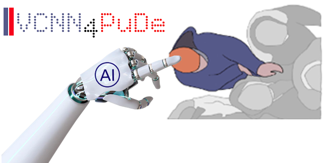
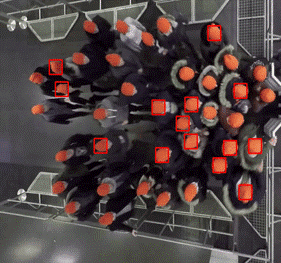

[](https://doi.org/10.5281/zenodo.8175476) [](https://opensource.org/licenses/MIT)   


# **VCNN4PuDe:** A Novel Voronoi-based CNN Framework for Pushing Person Detection in Crowd Videos
<p align='center'>

</p>
<hr/>


This repository is for the submited paper:
```
Alia, Ahmed, et al. "A Novel Voronoi-based Convolutional Neural Network Framework
for Pushing Person Detection in Crowd Videos". 2023
```
## Table of Contents
<ul>
<li>  <a href="#goal"> Goal </a>
<li><a href="#motivation">Motivation</a>
<li> <a href="#architicture">Architicture of VCNN4PuDe </a>
<li> <a href="#framework">Codes of VCNN4PuDe </a>
<li> <a href="#sample">Samples</a>
<li> <a href="#installation">Framework Installing </a>
<li> <a href="#running">Framework Running</a>
<li><a href="#cnn">Codes for CNN Architectures and Training</a>
<li><a href="#models">Trained CNN models</a>
<li><a href="#testsets">Test Sets</a>
<li><a href="#training">Codes for Trained CNN Models Evaluation</a>


</ul>

## Goal 
<a name="goal"/>
The main goal of this article is to introduce a framework (**VCNN4PuDe**) for identify the persons who engage in pushing within videos of crowds.

## Motivation
<a name="motivation"/>
 Detecting pushing persons within videos of crowded event entrances is crucial for understanding pushing dynamics, thereby designing and managing more comfortable and safer entrances.

## Architicture of **VCNN4PuDe** Framework
<a name="architicture"/>
<p align='center'>

</p>


## Codes of **VCNN4PuDe** Framework
<a name="framework"/>
<a href="Run.ipynb">Codes of VCNN4PuDe</a>


## Samples
<a name="sample"/>

**Input video with its trajectory data**

You can access them by this <a href="samples/">link</link>.

Note: They were  taken from <a href="http://ped.fz-juelich.de/da/2018crowdqueue"> Pedestrian Dynamics Data Archive </a> hosted by FZJ.


**Annotated Video produced by **VCNN4PuDe** Framework**


<p align='center'>
 
</p>

## **VCNN4PuDe** Installing  on Google Colab
<a name="installation"/>

 1. Create a directory named VCNN4PuDe on your drive.
 2. Access VCNN4PuDe directory.
 3. Add new notebook and run the follwing commands
 
    a. Mount Google Drive
    ```
    from google.colab import drive
    drive.mount('/content/gdrive')
    ```
    b. Access VCNN4PuDe directory Folder
    ```
    %cd /content/drive/My Drive/VCNN4PuDe/
    ```
    c. Clone VCNN4PuDe Framework
    ```
    git clone https://github.com/abualia4/VCNN4PuDe.git
    ```
    d. Install keras-preprocessing module
    ```
    !pip install keras-preprocessing
    ```
    
## **VCNN4PuDe** Running
<a name="running"/>


 Open the run notebook and follow the instructions in the notebook, and the annotated Video.mp4 will be stored in the annotated folder.
 
 
 **Note:** If some libraries are required for running the framework, use the following command to install it
 ```
 !pip install module/library name
 ```

## Codes for CNN Architectures and Training
<a name="cnn"/>
<a href="CNN-and-training.ipynb">Open the notebook</a>

## Trained Models
<a name="models"/>
All trained models produced in this article are available at this <a href="models" >link </a>

## Test Sets
<a name="testsets"/>
Two test sets are available at this <a href="test-sets" >link </a> 

## Codes for Trained Models Evaluation
<a name="training"/>
Two test sets are available at this <a href="CNN-and-training.ipynb" >link </a>  

### Acknowledgement
1. Thanks to the authors of voronoi\_finite\_polygons_2d function. 
2. Thanks to the author of Create_random_polygon class.
 
## citation
``` 
Soon
```

